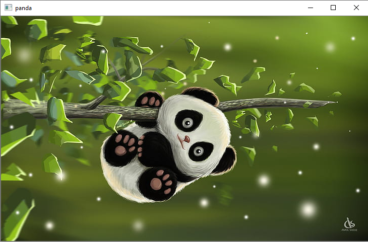
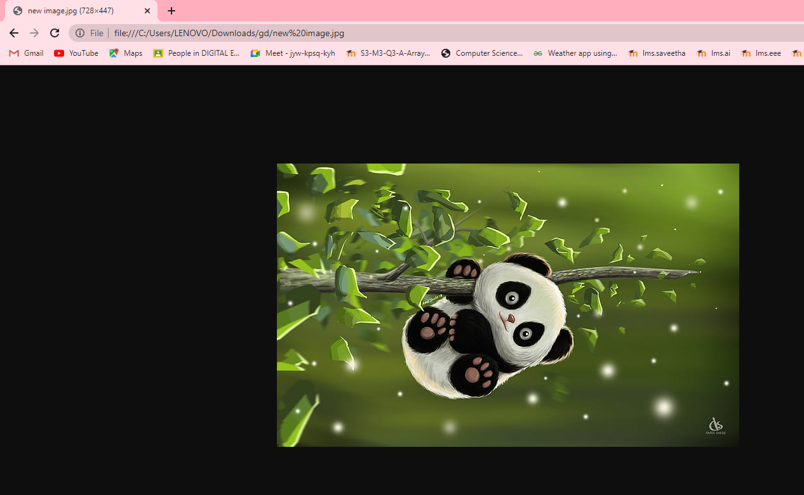
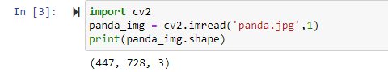
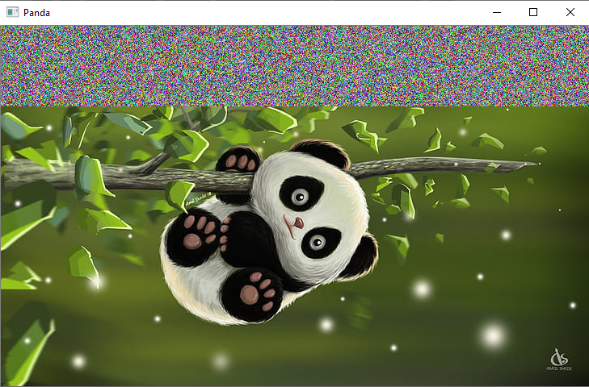
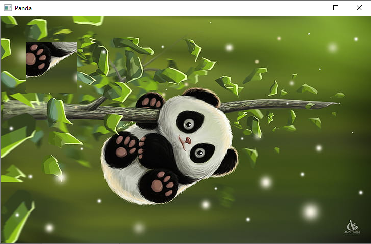

## EX NO : 01
## Date : 
# <p align="center"> READ AND WRITE AN IMAGE </P>


## AIM
To write a python program using OpenCV to do the following image manipulations.
i) Read, display, and write an image.
ii) Access the rows and columns in an image.
iii) Cut and paste a small portion of the image.

## Software Required:
Anaconda - Python 3.7
## Algorithm:
### Step1:
Choose an image and save it as a filename.jpg
### Step2:
Use imread(filename, flags) to read the file.
### Step3:
Use imshow(window_name, image) to display the image.
### Step4:
Use imwrite(filename, image) to write the image.
### Step5:
End the program and close the output image windows.

<br>
<br>
<br>
<br>

## Program:
```python
# Developed By:
Suganya P

# Register Number:
212220230049

# To Read,display the image
import cv2
panda_img = cv2.imread('panda.jpg',1)
cv2.imshow('panda',panda_img)
cv2.waitKey(0)
destroyAllWindows()


# To write the image
import cv2
panda_img = cv2.imread('panda.jpg',1)
cv2.imwrite('new image.jpg',panda_img)


# Find the shape of the Image
import cv2
panda_img = cv2.imread('panda.jpg',1)
print(panda_img.shape))


# To access rows and columns
import random
for i in range(100):
    for j in range(panda_img.shape[1]):
        panda_img[i][j] = [random.randint(0,255),random.randint(0,255),random.randint(0,255)]
cv2.imshow('Panda',panda_img)
cv2.waitKey(0)
destroyAllWindows()


# To cut and paste portion of image
import cv2
panda_img = cv2.imread('panda.jpg',-1)
tag = panda_img[300:400,300:400]
panda_img[50:150,50:150] = tag
cv2.imshow('Panda',panda_img)
cv2.waitKey(0)
destroyAllWindows()


```
## Output:

### i) Read and display the image

<br>
<br>
<br>
<br>
<br>
<br>
<br>
<br>
<br>
<br>
<br>
<br>
<br>
<br>
<br>
<br>
<br>
<br>
<br>
<br>
<br>

### ii)Write the image

<br>
<br>

### iii)Shape of the Image

<br>
<br>

### iv)Access rows and columns

<br>
<br>

### v)Cut and paste portion of image

<br>
<br>

## Result:
Thus the images are read, displayed, and written successfully using the python program.


